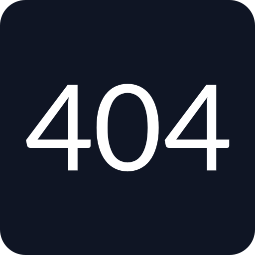

<!-- Improved compatibility of back to top link: See: https://github.com/othneildrew/Best-README-Template/pull/73 -->
<a name="readme-top"></a>
<!--
*** Thanks for checking out the Best-README-Template. If you have a suggestion
*** that would make this better, please fork the repo and create a pull request
*** or simply open an issue with the tag "enhancement".
*** Don't forget to give the project a star!
*** Thanks again! Now go create something AMAZING! :D
-->

<!-- PROJECT LOGO -->
<br />
<div align="center">
  <a href="https://github.com/CastillejaCode/portfolio">
    
  </a>

<h3 align="center">Not Found</h3>

  <p align="center">
    404 Page for Codédex's monthly challenge.
    <br />
    <br />
    <a href="https://404-page-7ty.pages.dev">View Demo</a>
    ·
    <a href="https://github.com/CastillejaCode/portfolio/issues">Report Bug</a>
    ·
    <a href="https://github.com/CastillejaCode/portfolio/issues">Request Feature</a>
  </p>
</div>

<!-- ABOUT THE PROJECT -->
## About The Project
### Screenshot
 

### Built With

<a href="https://nextjs.org/">  

</a> 
<br/>
<a href="https://tailwindcss.com/">  

</a>

### Inspiration
I wanted to create a 404 page that matched the main theme and style of [Codédex](https://www.Codédex.io/), gamification. It should be something that was informative while also being a small game in of itself.
Wanting to combine the Codédex coin with a game, my mind naturally wandered to making a Slot Machine. The slot numbers would be the response code, and a user could win by getting a "good" response code, 200. 
And just like a Slot Machine, a flurry of coins would fall randomly when a winning spin had been achieved. 
I also added the ability to drop even more coins when the user won to supoprt the gaming theme moreso; and thus, my idea had come to fruition.

### Features / Usage
- Slot Machine progressing through random numbers
  - Will always land on 404 when page is first loaded
  - Will always land on 200 (or any other number) in a random number of spins within a defined range, eg., the default is set to 3-5, so it will take 3, 4, or 5 spins to win
- Can always go back to the previous page if desired
- Many Codédex coins will fall randomly when the winning spin has been achieved
- When a win has been achieved, the user can click to drop a random number of coins from the heavens
- Messages when losing are randomized so it doesn't get boring
- Enter the Konami Code for a secret Easter Egg

 ### Optimizations
- Built on the same Next.JS version to ensure it will work and ease transfer for the Codédex team.
- Built on the same Styled Components version to again ensure an easier transfer.
- All design choices (colors, fonts, images, etc.) were implemented to match Codédex's design system as closely as possible.
  - Codédex Team can feel free to replace elements I tried to replicate, ie., buttons, with their own
- Responsive Design
- Only uses 1 extra dependency
  - Motion One, a simple animation library smaller than most. 
- Customization Galore, most functions have sensible default parameters which can be easily changed using objects
- Error Page is an actual error page since the main button takes you to a non-existent location

<!-- GETTING STARTED -->
## Getting Started

To get a local copy running, follow the instructions.

### Prerequisites

* pnpm
  ```
  npm install -g pnpm
  ```

### Installation

1. Clone the repo
   ```
   git clone https://github.com/CastillejaCode/portfolio.git
   ```
2. Install NPM packages
   ```
   pnpm install 
   ```
3. Run local development server
   ```
   pnpm dev
   ```
   
<!-- LICENSE -->
## License

Distributed under the MIT License. See `LICENSE.txt` for more information.

<!-- CONTACT -->
## Contact

Julian Krzysiak - jkrzysiak13@gmail.com

<!-- ACKNOWLEDGMENTS -->
## Acknowledgments

* Coin image - [Codédex](https://www.Codédex.io/)
* Favicon generator - [favicon.io](https://favicon.io/)

<p align="right">(<a href="#readme-top">back to top</a>)</p>
